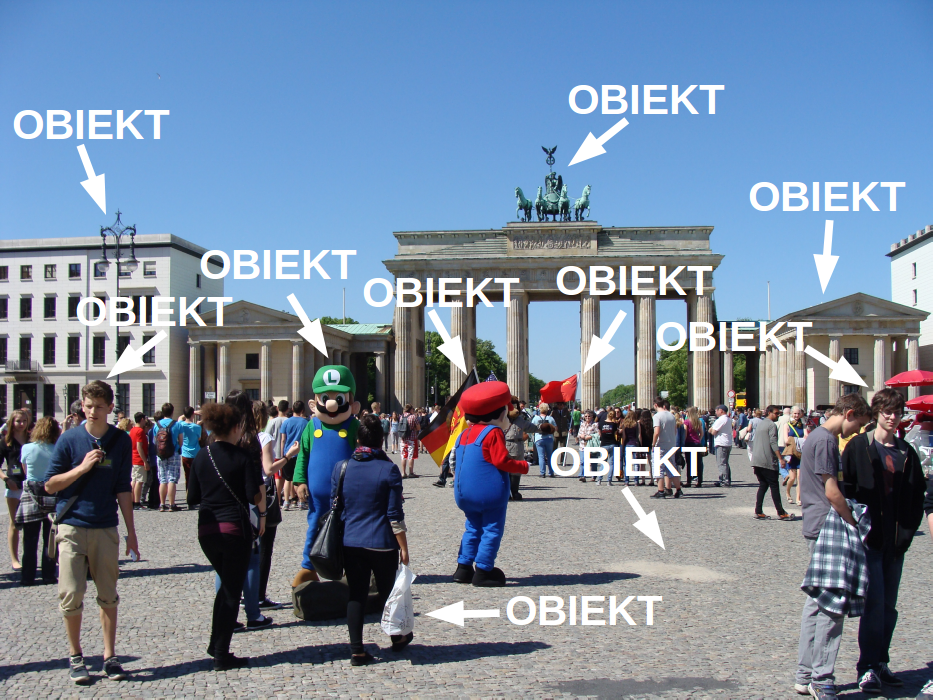
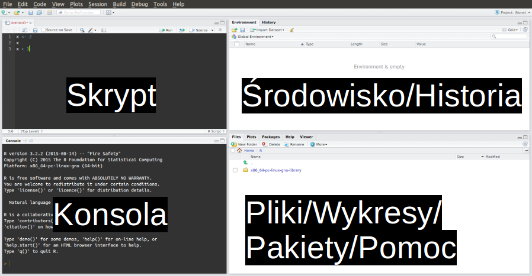

# R ergo sum {#ergosum}

<!-- kod nie przyjmuje literówek -->

## Wyrażenia

<!-- - wyrażenia (e.g. 2 + 2) -->
<!-- Natomiast zamiast głębokiej wiedzy matematycznej do większości zadań programistycznych wystarczy podstawowa znajomość algebry -->


```r
2 + 2
#> [1] 4
```


```r
1 - 3
#> [1] -2
```


```r
5 * 5
#> [1] 25
```


```r
42 / 5
#> [1] 8.4
```

## Obiekty

<!-- - obiekty (zmienne) -->


### Operator przypisania

Operator przypisania służy do nadania wartości do obiektu^[Jest to pewne uproszczenie - https://adv-r.hadley.nz/names-values.html#binding-basics.].
R posiada trzy operatory przypisania, które mają niemal identyczne działanie^[Więcej informacji na temat różnic w działaniu tych operatorów można znaleźć na stronie https://stackoverflow.com/questions/1741820/what-are-the-differences-between-and-in-r.]: `=`, `<-`, `->`.


```r
x = 7
```


```r
x
#> [1] 7
```


```r
y = x
```


```r
y
#> [1] 7
```

<!-- - operator przypisania + działanie w pamięci -->


### Działania na obiektach

<!-- - działania na obiektach -->


```r
z1 = x + 3
z1
#> [1] 10
```


```r
z2 = x - 5
z2
#> [1] 2
```


```r
z3 = x * 2
z3
#> [1] 14
```


```r
z4 = x / 4.4
z4
#> [1] 1.59
```


```r
z5 = x %% 3
z5
#> [1] 1
```


```r
z6 = x %/% 3
z6
#> [1] 2
```


```r
z7 = x ^ 2
z7
#> [1] 49
```


```r
z8 = sqrt(x)
z8
#> [1] 2.65
```


```r
z9 = c(z2, z4, z8)
z9
#> [1] 2.00 1.59 2.65
```

<!-- integer division block -->
<!-- floating-point errors, -->
<!-- floating-point arithmetic.  -->
<!-- Floating-point arithmetic is a feature of computer programming.  -->

## IDE

Rstudio to zintegorwane środowsko programistyczne (ang. *Integrated Development Environment*, IDE) dla R.
<!-- wyjaśnienie -->
Zawiera ono bardzo wiele użytecznych funkcjonalności, tj. wbudowany edytor, podświetlanie składni, automatyczne uzupełnianie kodu i wiele innych.



<!-- block - RStudio to nie R!! -->


Table: (\#tab:rstudiosk)Podstawowe skróty klawiaturowe w RStudio

Skrót                                 Wyjaśnienie                                                   
------------------------------------  --------------------------------------------------------------
Ctrl+Enter                            wykonuje wybraną linię kodu w skrypcie R                      
Tab                                   uzupełnia kod (podaje pasujące mozliwości)                    
F1                                    wyświetla plik pomocy dla wybranej funkcji                    
Ctrl+Shift+C                          ustawia wybrane linie jako komentarz/odkomentuj fragment kodu 
strzałka Góra/Dół (w oknie konsoli)   wybiera wcześniej wpisany kod                                 
Esc                                   przerywa niedokończoną operację                               
Shift+Alt+K                           wyświetla listę skrótów klawiaturowych                        


\BeginKnitrBlock{rmdinfo}<div class="rmdinfo">Dobrą praktyką pracy z R w RStudio jest używanie projektów RStudio (ang. *RStudio projects*).
Projekt jest to folder zawierający wszystkie skrypty i pozostałe pliki powiązane z jakimś zadaniem (np. analizą danych, czy stworzeniem nowego pakietu R).
Ułatwia on przenoszenie kodu pomiędzy różnymi komputerami, a także daje dostęp do szeregu dodatkowych możliwości w RStudio.

Aby stworzyć pierwszy projekt RStudio, należy:
1. Kliknąć `File -> New Project`.
2. Wybrać `New Directory`.
3. Wybrać `New Project`.
4. Podać nazwę nowego projektu, np. "programowanie1" oraz wybrać miejsce na dysku, gdzie ma się nowy projekt znajdować.
5. Jeżeli możliwe, to wybrać też opcję `Create a git repository`.
6. Kliknąć `Create Project`.</div>\EndKnitrBlock{rmdinfo}

## Dodatkowe materiały {#resources}

Polskie książki:

- http://www.biecek.pl/R/ [@biecekPrzewodnikPoPakiecie2014]
- http://www.gagolewski.com/publications/programowanier/ [@gagolewski2016programowanie]
- https://helion.pl/ksiazki/jezyk-r-kompletny-zestaw-narzedzi-dla-analitykow-danych-hadley-wickham-garrett-grolemund,jezrko.htm#format/d [@wickham2016r]
- https://helion.pl/ksiazki/wydajne-programowanie-w-r-praktyczny-przewodnik-po-lepszym-programowaniu-gillespie-colin-lovelace-robin,a_0491.htm#format/d [@gillespie2016efficient]
- https://bookdown.org/nowosad/Geostatystyka/ [@nowosadjakubGeostatystyka2019]

Angielskie książki:

- https://rstudio-education.github.io/hopr/ [@grolemund2014hands]
- https://r4ds.had.co.nz/ [@wickham2016r]
- https://csgillespie.github.io/efficientR/ [@gillespie2016efficient]
- https://adv-r.hadley.nz [@wickham2014advanced]
- https://geocompr.robinlovelace.net/ [@lovelace_geocomputation_2019]

Blogi:

- Agregator blogów dotyczących R - https://www.r-bloggers.com/
- Polski blog opisujący kwestie analizy danych w R, wizualizacji, oraz edukacji - http://smarterpoland.pl/
- Polski blog pokazujący zastosowanie R do analizy i wizualizacji danych - http://szychtawdanych.pl/

Kursy:

- Lista kursów dotyczących R na platformie DataCamp (część z nich jest dostępna bezpłatnie) - https://www.datacamp.com/search?q=r
- Polskie tłumaczenie pakietu R służącego do nauki tego języka - https://github.com/dabrze/swirl
- Lista kursów dotyczących R na platformie Coursera - https://www.coursera.org/courses?query=r
- Lista kursów dotyczących R na platformie edX - https://www.edx.org/course?search_query=r

\BeginKnitrBlock{rmdinfo}<div class="rmdinfo">Pisanie kodu oraz jego dokumentowanie opiera się w znacznym stopniu na wprowadzaniu znaków na klawiaturze do komputera.
Warto jest więc aby robić to w sposób [efektywny](https://csgillespie.github.io/efficientR/introduction.html#touch-typing), czyli taki w którym używamy wszystkich palców u rąk a nasz wzrok nie jest skupiony na klawiaturze.
Takie pisanie nazwa się pisaniem bezwzrokowym (ang. *touch typing*).
Pisanie bezwzrokowe ma szereg reguł, które wymagają przestawienia się ze starych nawyków oraz pewnego treningu. 
Na szczęście istnieje wiele internetowych zasobów, które ułatwiają naukę takiego pisania, między innymi strona [TypingClub](https://www.typingclub.com/).</div>\EndKnitrBlock{rmdinfo}

Serwisy internetowe:

- Wyszukiwarki internetowe są nieocenionym narzędziem wspierającym programowanie - https://rseek.org/, https://duckduckgo.com/, https://www.google.com/, https://www.bing.com/, itd.
- Serwis społecznościowy zawierający pytania i odpowiedzi dotyczące różnych języków programowania w tym R - https://stackoverflow.com.
Pytania dotyczące R można znaleźć pod adresem https://stackoverflow.com/questions/tagged/r. 
Przed zadaniem nowego pytania warto wyszukać czy nie zostało ono zadane wcześniej a następnie przeczytać wątek dotyczący tworzenia nowych pytań - https://stackoverflow.com/questions/5963269/how-to-make-a-great-r-reproducible-example
- Twitter jest miejscem, w którym można znaleźć zarówno nowości z języka R, jak również odpowiedzi na pytania dotyczące tego języka - https://twitter.com/. 
Kwestie związane z R są opatrzone hasztagiem `#rstats`, natomiast kwestie przestrzenne w R są opisywane hasztagami `#rspatial` oraz `#geocompr`
- Elektroniczny biuletyn R Weekly zbierający co tydzień nowości związane z r - https://rweekly.org/
- Lista emailowa dotycząca R - https://stat.ethz.ch/mailman/listinfo/r-help
- Lista emailowa dotycząca kwestii przestrzennych w R - https://stat.ethz.ch/mailman/listinfo/r-sig-geo
- Forum dotyczące kwestii R i RStudio - https://community.rstudio.com/

Meetups (spotkania początkujących i zaawansowanych użytkowników R):

- Poznań - https://www.meetup.com/pl-PL/Poznan-R-User-Group-PAZUR/
- Warszawa - https://www.meetup.com/pl-PL/Spotkania-Entuzjastow-R-Warsaw-R-Users-Group-Meetup/
- Wrocław - https://www.meetup.com/Wroclaw-R-Users-Group/
- Kraków - https://www.meetup.com/erkakrakow/
- Trójmiasto - https://www.meetup.com/Trojmiejska-Grupa-Entuzjastow-R/

## Styl

Poniżej znajdują się podstawowe porady dotyczące stylu pisania kodu. 
Więcej wskazówek można znaleźć na w [poradniku stylu RStudio](https://style.tidyverse.org/) oraz [poradniku stylu Google](https://google.github.io/styleguide/Rguide.xml).
Oba te poradniki nie są identyczne i czasami zawierają sprzeczne porady. 
Najważniejsze jest, aby wybrać jeden odpowiadający piszącemu kod styl i się go konsekwentnie trzymać. 

### Nazwy obiektów

Istnieje wiele konwencji nazywania obiektów^[https://en.wikipedia.org/wiki/Naming_convention_(programming)]. 
Najczęściej używaną konwencją w R jest tzw. ["snake case"](https://en.wikipedia.org/wiki/Snake_case).
Polega ona na tworzeniu nazw obiektów składających się ze słów połączonych znakiem podkreślenia (`_`).
<!-- obiekty rzeczowniki, funkcje czasowniki -->
Ważne, żeby nazwy obiektów ułatwiały zrozumienie ich zawartości.


```r
# obiekt
bok_a
bok_b

# funkcja
pole_prostokata
```

Nazwa obiektu nie może zaczynać się od liczby, ani nie może używać specjalnych symbolii, tj. `^`, `!`, `$`, `@`, `+`, `-`, `/`, czy `*`.
Dodatkowo należy uważać, żeby nowa nazwa obiektu nie nadpisała istniejącego obiektu lub funkcji.
Nie powinno nazywać się obiektów tak jak istniejące funkcje, np. `c`, `t`, `table`, itd.

### Odstępy

Odstępy pełnią bardzo ważną funkcję przy pisaniu kodu, podobnie jak odstępy przy pisaniu tekstu.
Wyobraź sobie czytanie powieści, w której nie ma żadnych odstępów między słowami czy rozdziałami.
<!-- indentation python -->
Często mówi się, że "kod musi oddychać" - odstępy zwiększają czytelność kodu i pozwalają na jego szybsze zrozumienie oraz ułatwiają naprawienie występujących błędów.

Odstępy można uzyskać poprzez użycie spacji.
Spacje powinny być użyte po przecinkach, ale nigdy przed nimi. Dodatkowo, większość operatorów (np. `=`, `+`, `-`, `==`) powinna być otoczona przez spacje.


```r
# Zalecane
srednia = mean(wartosc, na.rm = TRUE)
pole = bok_a * bok_b

# Niewskazane
srednia=mean ( wartosc,na.rm=TRUE ) 
pole=bok_a*bok_b
```

Spacje należy również używać do tworzenia wcięć - każde z nich powinno się składać z dwóch spacji.
<!-- tab space war -->


```r
# Zalecane
moja_funkcja = function(x, y, z){
  pod = y / z
  wynik = x * pod
  wynik
}

# Niewskazane
moja_funkcja = function(x, y, z){
pod = y / z
wynik = x * pod
wynik
}
```

Warto także ograniczać długość każdej linii kodu, żeby nie przekraczała ona ok. 80 znaków.
Dzięki temu możliwe jest szybkie przeczytanie kodu czy też jego wydrukowanie.


```r
# Zalecane
bardzo_wazny_wynik = moja_bardzo_wazna_funkcja("pierwszy argument",
                                               b = "drugi argument", 
                                               c = "trzeci argument")

# Niewskazane
bardzo_wazny_wynik = moja_bardzo_wazna_funkcja("pierwszy argument", "drugi argument", "trzeci argument")
```

### Komentarze

Komentarze służą do wyjaśniania istotnych elementów kodu.
Do komentowania w języku R służy operator `#`.


```r
# Mój komentarz
```

### Nazwy plików

Nazwy plików powinny spełniać trzy wymagania - być łatwe  (i) do odczytania przez komputer, (ii) do odczytania przez człowieka, (iii) do posortowania.

Nazwy plików nie powinny zawierać spacji, znaków specjalnych (np. !, %, *), znaków diakrytycznych (np. ć, Ł, ź).
Warto też aby nazwy plików składały się tylko z małych liter.


```r
# Zalecane
obliczanie-sredniej.R
pomiary-temperatury.csv

# Niewskazane
Obliczanie Średniej.R
pomiaryTemperatury!.csv
```

Podobnie jak nazwy obiektów, również nazwy plików powinny opisywać ich zawartość.


```r
# Zalecane
obliczanie-sredniej.R
pomiary-temperatury.csv

# Niewskazane
kod.R
dane.csv
```

Dodatkowo wskazane jest dodanie wartości numerycznych przed nazwą pliku, jeżeli pliki mają jakąś kolejność.


```r
# Zalecane
01_przygotowanie-danych.R
02_obliczanie-sredniej.R

# Niewskazane
przygotowanie-danych.R
obliczanie-sredniej.R
```

\BeginKnitrBlock{rmdinfo}<div class="rmdinfo">encodings</div>\EndKnitrBlock{rmdinfo}

<!--^[kodowanie znaków]-->

### Daty

Istnieje wiele sposóbów zapisu dat^[https://xkcd.com/1179/], co może powodować różnorodne problemy przy programowaniu oraz analizie danych.
Z ratunkiem w tej kwestii przychodzi norma [ISO 8601](https://en.wikipedia.org/wiki/ISO_8601), która definiuje daty kalendarzowe jako *YYYY-MM-DD*, czyli *ROK-MIESIĄC-DZIEŃ*.


```r
# Zalecane
2019-06-02

# Niewskazane
wszelkie inne
```

## Zadania

<!-- może użycie podstawowych funkcji na wektorach i co to znaczy - length, paste, etc.? -->
