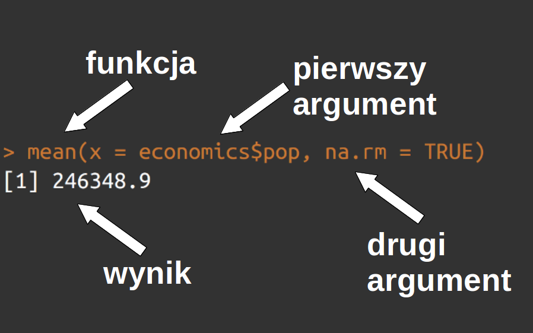

# Funkcje {#funkcje}

Funkcje to programy, który przyjmują pewne argumenty, przetwarzają je i zwracają jakiś wynik.
Są one zbudowane z dostępnych elementów języka programowania jak i też z innych dostępnych funkcji.
Funkcje mogą służyć do wielu celów, od prostych odliczeń arytmetycznych, poprzez przetwarzanie tekstu, tworzenie wykresów i map, aż do bardziej złożonych i specjalistycznych procedur. 
Ich celem jest ułatwienie pracy programistycznej i zwiększenie czytelności kodu. 
Zamiast wielokrotnie powtarzać te same linie kodu, możliwe jest napisanie funkcji raz, a następnie użycie jej wiele razy.

## Struktura funkcji

Funkcje są reprezentowane w R jako specjalne obiekty, które można uruchomić poprzez dodanie do ich nazwy nawiasów okrągłych.
Przykładowo, funkcja `mean()` wylicza średnią.
Może ona przyjąć kilka różnych argumentów, czyli pewnych obiektów lub parametrów wejściowych.
W poniższym przykładzie do funkcji `mean()` zostały podane dwa argumenty (rycina \@ref(fig:funstr)).
Pierwszy argument nazywa się `x` i przyjmuje on wektor numeryczny `economics$pop`, drugi argument nazywa się `na.rm` i został on ustalony na `TRUE`.

```{r funstr, echo=FALSE, fig.cap="Przykład struktury funkcji w R.", out.width="80%"}

```

W efekcie działania funkcji otrzymano wynik - `246348.9` - który jest średnią wartością w zadanym wektorze.

## Wbudowane funkcje

R posiada wiele wbudowanych funkcji, które znacznie ułatwiają wykonywanie bardziej złożonych operacji.
Pierwsze z funkcji, w tym `c()`, zostały już poznane w sekcji \@ref(dzialania-na-obiektach).
Ta funkcja pozwala na łączenie kolejnych obiektów rozdzielonych przecinkami.
Poniższy obiekt, `x` jest w efekcie wektorem zawierającym trzy wartości `8.2`, `10.3` oraz `12.0`.

```{r}
x = c(8.2, 10.3, 12.0)
x
```

Wyliczenie średniej z tych trzech wartości wymaga ich zsumowania, a następnie podzielenia uzyskanej wartości przez liczbę wartości.

```{r}
(8.2 + 10.3 + 12.0) / 3
```

W przypadku jednak, gdy chcemy dodać czwartą, piątą, itd. wartość należy zmieniać kod w co najmniej dwóch miejscach.
Konieczne jest dodanie nowej wartości do zsumowania, a następnie zmianę wartości określającej liczbę elementów.

Zamiast tych dwóch operacji, można wykonać tylko jedną zmianę w obiekcie `x`, a następnie przetworzyć go używając funkcji wbudowanych w R - `sum()` oraz `length()`.
Pierwsza z nich sumuje wartości z wektora, druga natomiast zwraca liczbę elementów w wektorze.

```{r}
sum(x) / length(x)
```

Powyższy kod można też dalej uprościć, poprzez użycie wbudowanej w R funkcji do liczenia średniej - `mean()`.

```{r}
mean(x)
```

Jej użycie powoduje, że wystarczy wykonać tylko jedną zmianę w obiekcie `x`, aby uzyskać poprawny wynik, a dodatkowo napisanie tego obliczenia wymaga napisania znacznie krótszego kodu.

Funkcje można używać w celu wyświetlenia oczekiwanego rezultatu, ale także, aby na podstawie wyniku funkcji tworzyć nowe obiekty, takie jak `y` poniżej.

```{r}
y = mean(x)
y
```

## Kolejność wykonywania funkcji {#kolejnosc-funkcji}

Wykonywanie funkcji w R odbywa się linia po linii, od góry do dołu.

```{r}
a = 4
b = 5
a2 = a^2
b2 = b^2
```

R pozwala na dwa podstawowe sposoby łączenia działania wielu funkcji^[Istnieje też szereg dodatkowych sposobów, wśród których najpopularniejszy polega na używaniu operatora `%>%` z pakietu **magrittr** [@R-magrittr].].
Pierwszy z nich polega na tworzeniu pośrednich obiektów jako wyników działania pojedynczych funkcji.

```{r}
suma_a2b2 = sum(a2, b2)
przekatna = sqrt(suma_a2b2)
przekatna
```

Drugi sposób opiera się o zagnieżdżanie funkcji. 
W tej sytuacji najpierw wykonywana jest funkcja w środku, na następnie kolejne funkcje coraz bliżej brzegu.

```{r}
przekatna = sqrt(sum(a2, b2))
przekatna
```

## Dokumentacja funkcji

Każda wbudowana funkcja w R posiada swoją dokumentację^[Niektóre zbiory danych również posiadają swoje pliki pomocy.].
Można ją wyświetlić poprzez dodanie znaku zapytania przed nazwą funkcji, a następnie wykonanie tej linii kodu.

```{r, eval=FALSE}
?mean
```

Alternatywnie, w RStudio możliwe jest użycie skrótu F1 gdy kursor znajduje się na nazwie funkcji.

Dokumentacja każdej funkcji, zwana inaczej plikiem pomocy, ma zazwyczaj podobną strukturę.

- W lewym górnym rogu znajduje się nazwa funkcji (`mean`) oraz nazwa pakietu z którego dana funkcja pochodzi (`base`).
- Poniżej znajduje się tytuł funkcji oraz jej krótki opis.
- Kolejnym elementem jest budowa funkcji (*Usage*), która skrótowo opisuje z jakich argumentów składa się dana funkcja.
Np. funkcja `mean()` przyjmuje argument `x`, `trim`, oraz `na.rm`. 
Dla argumentów `trim` oraz `na.rm` są także ustalone ich domyślne wartości.
Dodatkowo, widoczny jest argument w postaci wielokropka (`...`). 
<!--!?-->
- Argumenty funkcji są również wypisane oraz skrótowo wyjaśnione. 
Przykładowo, `x` musi być obiektem R o typie numerycznym (który łączy typ liczb całkowitych i zmiennoprzecinkowych<!--ref-->), logicznym, `date`, `date-time`, lub `time interval`.
- Część *Value* (lub *Details*) opisuje szczegóły wykonywanej funkcji.
- Inne możliwe elementy to np. *References* odnoszący się do artykułu czy książki opisującej daną funkcję lub metodę, czy też *See also* zawierający odnośniki do innych, podobnych funkcji.
- Jeden z najważniejszych elementów pliku pomocy znajduje się na samym końcu - są to przykłady (*Examples*).
Jeżeli nie jesteśmy pewni jak dana funkcja działa warto zacząć od skopiowania przykładów a następnie ich wykonania.

Czytanie dokumentacji wymaga pewnej wprawy i doświadczenia. 
Nie bój się używać innych źródeł pomocy (zobacz sekcję \@ref(resources)), jeżeli potrzebujesz zrozumieć działanie danej funkcji.

## Pakiety

Pakiet to zorganizowany zbiór funkcji, który rozszerza możliwości R.
<!-- przykłady -->
Pakiety oprócz kodu zawierają szereg dodatkowych istotnych elementów, takich jak:

- Informacja o wersji pakietu, jego twórcach, zależnościach, czy licencji
- Dokumentacja
- Przykładowe dane
- Testy kodu

Pakiety R mogą być przechowywane i instalowane z wielu miejsc w internecie. 
Istnieje jednak jedno centralne repozytorium (CRAN, ang. *the Comprehensive R Archive Network*), które zawiera oficjalne wersje pakietów R. 
Wersje deweloperskie (rozwojowe) często można znaleźć na platformie [GitHub](https://github.com/).

Do instalacji pakietu w R z repozytorium CRAN służy wbudowana funkcja `install.packages()`, np:

```{r, eval=FALSE}
install.packages("stringr") #instalacja pakietu stringr
```

Zainstalowanie pakietu w R z platformy GitHub jest możliwe używając, np. funkcji `install_github()` z pakietu **remotes**.

```{r, eval=FALSE}
# install.packages("remotes")
remotes::install_github("tidyverse/stringr")
```

W przypadku instalacji pakietu w R z platformy GitHub należy podać nazwę użytkownika lub organizacji, która tworzy ten pakiet (np. powyżej `tidyverse`) oraz nazwę pakietu (np. powyżej `stringr`) oddzielone znakiem `/`.

Podobnie jak instalowanie programów na komputerze - zainstalowanie pakietu odbywa się tylko jeden raz.

```{block2 type="rmdinfo"}
Istnieją dwa główne formy, w których rozpowszechniane są pakiety R - postać źródłowa (ang. *source packages*) i postać binarna (ang. *binary packages*).
Postać źródłowa zawiera kod źródłowy pakietu, który musi zostać następnie skompilowany na komputerze użytkownika.
Skompilowanie pakietu na podstawie kodu źródłowego może wymagać posiadania odpowiednich bibliotek na komputerze, np. [Rtools](https://cran.r-project.org/bin/windows/Rtools/) dla systemu Windows czy też narzędzia Xcode dla Mac OS.
Dodatkowo, instalacja w ten sposób zabiera więcej czasu.
Postać binarna została już wcześniej skompilowana na zewnętrznym komputerze (np. w repozytorium CRAN)
Jest ona dostępna dla systemów Windows i Mac OS.
Niestety, nie wszystkie pakiety (lub ich wersje) posiadają postać binarną i wymagana jest ich kompilacja.
```

Użycie wybranego pakietu wymaga dołączenia go do R za pomocą funkcji `library()`.
Dołączenie wybranych pakietów do R robimy po każdym uruchomieniu R.

```{r}
library(stringr)
```

W przypadku, gdy chcemy użyć zewnętrznej funkcji, ale nie dołączyliśmy odpowiedniego pakietu, pojawi się błąd o treści `could not find function "nazwa_funkcji"`.

```{r, eval=FALSE}
str_sub("chronologia", start = 1, end = 6)
#> Error in str_sub("chronologia", start = 1, end = 6) : 
#>  could not find function "str_sub"
```

Istnieją dwa możliwe rozwiązania powyższego problemu.
Po pierwsze możliwe jest dołączenie pakietu poprzez  `library(stringr)`.
Po drugie można bezpośrednio zdefiniować z jakiego pakietu pochodzi konkretna funkcja używając nazwy pakietu i operatora `::`.

```{r}
stringr::str_sub("chronologia", start = 1, end = 6)
```

```{block2 type="rmdinfo"}
Operator `::` może być też pomocny w przypadku, gdy kilka pakietów ma funkcję o tej samej nazwie.
Wówczas, aby kod został poprawnie wykonany, warto podać nie tylko nazwę funkcji ale też nazwę pakietu z jakiego ona pochodzi.
```

<!-- block - inaczej biblioteki, moduły, etc -->

<!-- overwhelmed by the number! -->
<!-- https://juliasilge.com/blog/r-journal-navigating/ -->

## Algorytmy

Algorytm to zbiór kroków prowadzących do uzyskania określonego celu.
Algorytmy można porównać do przepisu kucharskiego, w którym opisany jest szereg czynności aby uzyskać konkretną potrawę.
Podobnie jak w przepisie kucharskim, algorytmy wymagają posiadania odpowiednich składników - danych wejściowych w o pewnej strukturze.

Tworzenie nowych algorytmów często zaczyna się od narysowania schematu procedury działania lub też pseudokodu. 
Kolejnym krokiem jest zapisanie tego algorytmu w wybranym języku lub językach programowania<!--^[Łączenie różnych języków programowania jest wyjaśnione w rozdziale \@ref(lacznik)]--> w formie skryptu (sekcja \@ref(tworzenie-skryptow)) lub funkcji (sekcja \@ref(budowanie-funkcji)).

## Tworzenie skryptów {#tworzenie-skryptow}

<!--kodowanie tekstu-->
Skrypt w R to plik testowy z rozszerzeniem `.R`, który zawiera szereg linii kodu w celu uzyskania konkretnego efektu.
Może on zawierać zaledwie kilka jak i setki linii kodu w zależności od złożoności postawionego problemu.
Zobaczmy jak wyglądają skrypty na prostym przykładzie - przeliczania wartości temperatury w stopniach ze skali Fahrenheita na skalę Celsjusza.
Otrzymaliśmy informację, że w "mieście A" temperatura w stopniach Fahrenheita wynosi 75.

```{r}
miasto_a_f = 75
```

Pierwszym naszym krokiem powinno być dowiedzenie się jaka jest relacja pomiędzy skalą Fahrenheita na skalą Celsjusza.

$$T_{Celsjusz} = \frac{T_{Fahrenheit} - 32}{1.8}$$

Następnie powyższy wzór można przepisać do postaci kodu w języku R oraz podstawić do niego wartość temperatury w stopniach Fahrenheita w mieście A.
Ostatnim etapem jest wyświetlenie uzyskanego wyniku - temperatura w mieście A wynosi ok. 24 stopnie Celsjusza.

```{r}
miasto_a_c = (miasto_a_f - 32) / 1.8
miasto_a_c
```

Powyższe kroki można również zapisać do pliku tekstowego. 

```{r, eval=FALSE}
# plik przeliczanie-temp.R
miasto_a_f = 75
miasto_a_c = (miasto_a_f - 32) / 1.8
miasto_a_c
```

Co można zrobić jeżeli mamy więcej podobnych pomiarów, które chcemy wykonać?
Najprostszą opcją jest użycie kopiuj/wklej i powielenie tego samego kodu, a później naniesienie małych zmian, np. nazw obiektów.
<!-- ^[o wekrtoryzacji] -->
<!-- or use data.frame? -->

```{r}
miasto_a_f = 75
miasto_b_f = 110
miasto_c_f = 0
miasto_a_c = (miasto_a_f - 32) / 1.8
miasto_b_c = (miasto_b_f - 32) / 1.8
miasto_c_c = (miasto_c_f - 32) / 1.8
```

Powyższe podejście jest poprawne, ale ma ono kilka wad:

* Łatwo jest o popełnienie jakiegoś prostego błędu lub literówki podczas adaptacji kodu (np. można zapomnieć zmienić nazwę jakiejś zmiennej).
* Jeżeli obliczenia zajmują więcej niż kilka linii kodu - wówczas kopiowanie go znacznie powiększa tworzony skrypt i utrudnia jego czytelność.
* Poprawienie kodu w przypadku zauważenia błędu w procedurze obliczeniowej jest czasochłonne.

To podejście jest też niezgodne z jedną z najważniejszych reguł w programowaniu - regułą DRY (Nie powtarzaj się, ang. *Don't Repeat Yourself*).
Zamiast tworzenia skryptu w oparciu o kopiuj/wklej lepiej pomyśleć nad zbudowaniem odpowiedniej funkcji^[@wickham2016r radzą tworzyć nowe funkcje, gdy ten sam kod powtarza się co najmniej trzy razy.].

## Budowanie funkcji

Funkcje pozwalają na automatyzację często używanych obliczeń.
Formalnie funkcje składają się z trzech elementów: listy argumentów (ang. *formals*), ciała funkcji (ang. *body*) oraz środowiska (ang. *environment*).
Pierwsze dwa elementy ustala twórca funkcji, natomiast środowisko jest określane na podstawie tego, gdzie dana funkcja została zdefiniowana<!--^[footnote o environment]https://rstudio-education.github.io/hopr/environments.html-->.
Dodatkowo każda funkcja ma swoją nazwę.

```{r}
moja_funkcja = function(x, y, z){
  pod = y / z
  wynik = x * pod
  wynik
}
```
<!-- wynik vs return(wynik) -->

Lista argumentów wymienia obiekty wejściowe funkcji.

```{r}
formals(moja_funkcja)
```

Ciało zawiera kod danej funkcji.

```{r}
body(moja_funkcja)
```

Środowisko określa, gdzie dana funkcja jest zlokalizowana.

```{r}
environment(moja_funkcja)
```

Przykładowa funkcja odpowiadająca problemowi z poprzedniej sekcji może wyglądać w poniższy sposób:

```{r}
konwersja_temp = function(temperatura_f){
    (temperatura_f - 32) / 1.8
}
```

Nowa funkcja nazywa się `konwersja_temp()` oraz posiada tylko jeden argument `temperatura_f`.
Ciało funkcji zawiera natomiast wzór potrzebny do obliczeń przepisany do R.
Ważne jest to, że obiekt użyty wewnątrz funkcji (`temperatura_f`) jest taki sam jak wejściowy argument.

Po stworzeniu funkcji warto sprawdzić czy jej działanie odpowiada naszym oczekiwaniom.

```{r}
konwersja_temp(75)
konwersja_temp(110)
konwersja_temp(0)
konwersja_temp(c(0, 75, 110))
```

## Komunikaty

Oprócz wyniku danej operacji R może wyświetlić kilka rodzajów komunikatów.
Trzy podstawowe z nich to:

1. Błędy (ang. *errors*)
2. Ostrzeżenia (ang. *warnings*)
3. Wiadomości (ang. *messages*) 

Błędy oznaczają, że wykonanie danej funkcji nie może być kontynuowane i przerwane jest jej działanie.
Przykładowo, w poniższym kodzie podjęta została próba wyliczenia logarytmu naturalnego z tekstu `"abecadło"`.
Takie obliczenie nie jest możliwe, w efekcie pojawił się komunikat błędu a kod nie został wykonany.

```{r, error=TRUE}
log("abecadło")
```

Ostrzeżenia zazwyczaj występują kiedy nastąpił jakiś problem z wykonaniem funkcji, ale jej działanie mogło być dokończone.
Często sugerują one użytkownikowi, aby dokładnie przyjrzał się wykonywanej funkcji i upewnił się czy na pewno ustala on odpowiednie wartości dla argumentów funkcji.
Poniżej została podjęta próba wyliczenia logarytmu naturalnego dla wartości ujemnej.
W efekcie pojawił się komunikat błędu, który mówi, że w wyniku zostały stworzone wartości `NaN` (ang. *Not a Number*).

```{r}
log(-1)
```

Wiadomości pojawiają się, aby przekazać użytkownikowi jakąś informację.
<!-- Może to dotyczyć np.  -->

```{r, echo=FALSE}
inna_funkcja = function(x){
  message("Chcę ciebie o czymś poinformować.")
  log(x)
}
```

```{r}
inna_funkcja(15)
```

Opis tworzenia komunikatów błędu, ostrzeżenia i wiadomości można znaleźć w rozdziale \@ref(zlozone-funkcje).

## Zadania {#zad3}

1) Zobacz jak wygląda plik pomocy funkcji `mean()`.
Wykonaj zawarte w nim przykłady.
Co przedstawiają uzyskane wyniki?
2) Zainstaluj pakiet **magrittr**. 
Spróbuj użyć operatora `%>%` z tego pakietu na przykładzie z sekcji \@ref(kolejnosc-funkcji) dotyczącym wyliczania przekątnej prostokąta.
3) Stwórz nowy plik skryptu R nazywający się `01_zadania-funkcje.R`.
W tym pliku, stwórz nowy obiekt `poznan`, który przyjmuje wartość `8.4`, napisz przeliczenie wartości tego obiektu ze stopni Celsjusza na stopnie Fahrenheita, a następnie wyświetl uzyskany wynik.
Uwaga: pamiętaj o ustawieniu odpowiedniego kodowania znaków dla tego nowego pliku.
4) Stwórz nową funkcję, która służy do przeliczania wartości ze stopni Celsjusza na stopnie Fahrenheita.
Jak nazwiesz taką funkcję?
5) Stwórz nową funkcję, która służy do przeliczania wartości z mil lądowych na kilometry.
Jak nazwiesz taką funkcję?
6) Stwórz nową funkcję, która służy do przeliczania wartości z metrów na sekundę na kilometry na godzinę.
Jak nazwiesz taką funkcję?
7) Stwórz nową funkcję, która służy do przeliczania wartości z metrów na sekundę na mile lądowe na godzinę.
Jak nazwiesz taką funkcję?
8) Stwórz nową funkcję, która służy do wyliczania pola trapezu na podstawie długości podstaw oraz wysokości trapezu.
Jak nazwiesz taką funkcję?
9) Wykonaj poniższy kod. 
Co oznacza uzyskany wynik?
```{r, error=TRUE, eval=FALSE}
mean()
```
10) Wykonaj poniższy kod. 
Co oznacza uzyskany wynik?
```{r, error=TRUE, eval=FALSE}
mean("abecadło")
```
11) Wykonaj poniższy kod. 
Co oznacza uzyskany wynik?
```{r, error=TRUE, eval=FALSE}
mean(sqrt())
```
12) Wykonaj poniższy kod. 
Co oznacza uzyskany wynik?
```{r, error=TRUE, eval=FALSE}
str_length("abecadło")
```
13) Wykonaj poniższy kod. 
Co oznacza uzyskany wynik?
```{r, error=TRUE, eval=FALSE}
u = 2
z = 3 + v
v = 7
```


