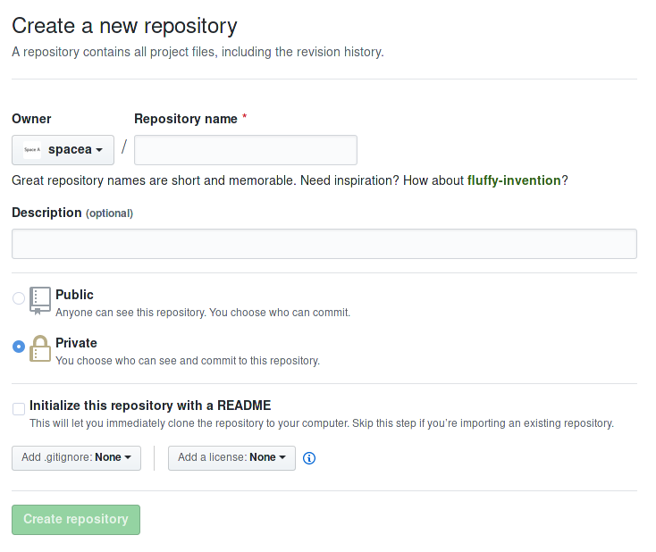
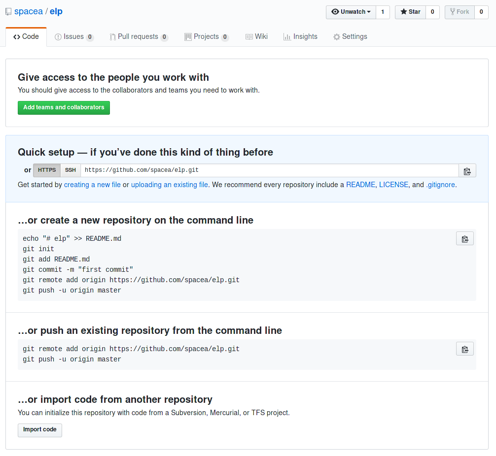
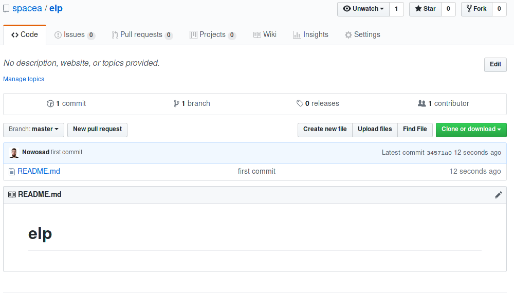
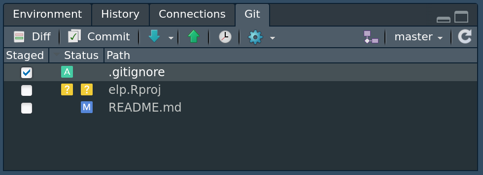

# Kontrola wersji {#kontrola-wersji}

Systemy kontroli wersji to narzędzia pozwalające na zapamiętywaniu zmian zachodzących w plikach.
Dzięki nim możemy sprawdzić nie tylko kiedy zmieniliśmy dany plik i kto go zmienił, ale co najważniejsze - możemy linia po linii prześledzić zmiany wewnątrz tego pliku.
Dodatkowo, mamy możliwość przywracania wersji pliku z wybranego czasu w całej historii jego zmian.

Systemy kontroli wersji są bardzo powszechnie wykorzystywane przy tworzeniu wszelakiego rodzaju oprogramowania.
Wynika to nie tylko z ich zalet wymienionych powyżej, ale również rozbudowanych możliwości pozwalających na zorganizowaną współpracę wielu osób nad jednym projektem.

Istnieje wiele systemów kontroli wersji różniących się zarówno używaną terminologią, sposobem działania czy możliwościami.^[https://en.wikipedia.org/wiki/Comparison_of_version-control_software#History_and_adoption]
Współcześnie najbardziej popularnym systemem kontroli jest Git, któremu będzie poświęcona reszta tego rozdziału.
Inne popularne systemy kontroli wersji to Concurrent Versions System (CVS), Mercurial czy Subversion (SVN).

<!-- gdzie wykorzystywaneC -->


## Git

System Git jest niezależny od języka (lub języków) programowania, które używamy.
Jego działanie oparte jest o system komend rozpoczynających się od słowa `git `, które należy wykonać w systemowym oknie konsoli.^[Nie w oknie konsoli R.]
Zrozumienie działania systemu Git wymaga także poznania kilku nowych terminów.

System Git został zaprojektowany i jest używany głównie do kontroli wersji plików tekstowych.
Dzięki temu możemy w prosty sposób zobaczyć, co do linii kodu, w którym miejscu zaszła zmiana.
Dodatkowo przechowywanie plików tekstowych i ich zmian nie zajmuje dużo miejsca. 
Możliwe w systemie Git jest również przechowywanie kolejnych wersji plików binarnych (np. pliki dokumentów, arkusze kalkulacyjne, obrazki, itd.).
W ich przypadku niestety nie można liczyć na dokładne sprawdzanie miejsc zmian, a także ich wielkość może powodować znaczne powiększanie się repozytorium.^[Między innymi z tego powodu internetowe serwisy kontroli wersji posiadają ograniczenia dotyczące wielkości plików. 
Przykładowo, GitHub ogranicza wielkość pojedynczych plików do 100MB.]

Git składa się z kilkudziesięciu komend, których działanie jest dalej uzależnione od podanych argumentów.
Tutaj przedstawiony zostanie tylko podzbiór najczęściej używanych.
Pełniejszy opis komend systemu Git można znaleźć pod adresem https://education.github.com/git-cheat-sheet-education.pdf lub http://rogerdudler.github.io/git-guide/index.pl.html.

### Konfiguracja systemu Git

Kolejnym krokiem po instalacji systemu Git^[Instrukcje dotyczące instalacji Gita znajdują się we wstępie książki.] jest jego konfiguracja. 
Można ją wykonać używając wbudowanego terminala (Mac OS i Linux) lub terminala dodanego podczas instalacji systemu Git (Windows).
Polega ona na podaniu nazwy użytkownika (np. `"Imie Nazwisko"`) oraz jego adresu email (`"email@portal.com"`).

```{bash, eval=FALSE}
git config --global user.name "imie nazwisko"
git config --global user.email "email"
```

### Repozytorium

Podstawowym z nich jest repozytorium (ang. *repository*, często określane skrótowo jako repo).
Jest to folder, który przechowuje wszystkie pliki i foldery w ramach jednego projektu.^[W kontekście R, warto o tym myśleć jako o projekcie RStudio.]
Dodatkowo wewnątrz repozytorium znajduje się ukryty folder `.git`, który zawiera informację o historii i zmianach każdego z naszych plików.
Repozytorium może znajdować się na dysku naszego komputera (wtedy jest nazywane repozytorium lokalnym) lub też na serwerze w internecie (określane jako repozytorium zdalne (ang. *remote*)).
Istnieje wiele serwisów internetowych pozwalających na tworzenie, przechowywanie i edycję repozytoriów zdalnych, między innymi [GitHub](https://github.com/) (przybliżony w sekcji \@ref(github)), [GitLab](https://gitlab.com/), czy [BitBucket](https://bitbucket.org/).

```{bash, eval=FALSE}
# określenie obecnego katalogu jako repozytorium Git
git init                  
```

### Dodawanie zmian

W nowo utworzonym repozytorium możemy tworzyć nowe pliki oraz edytować już istniejące.
Po pewnym czasie możemy stwierdzić, że dodaliśmy nową funkcjonalność do funkcji lub naprawiliśmy błąd w kodzie.
Wtedy należy (po zapisaniu również pliku na dysku) dodać te zmiany do systemu Git.
Po dodaniu zmian są one przechowywane w miejscu określanym jako *Index*.
Działa ono jak poczekalnia - w tym momencie zmiany jeszcze nie są potwierdzone, ale możemy sprawdzić co zmieniło się od ostatniego zatwierdzenia zmian.

```{bash, eval=FALSE}
# dodanie pojedynczego pliku
git add sciezka_do_pliku  
# dodanie wszystkich plików 
git add --all                    
```

### Sprawdzanie zmian

Zanim zatwierdzimy zmiany można je sprawdzić.
W ten sposób dla każdej linii tekstu (kodu) otrzymuje się informacje co zostało dodane lub usunięte.

```{bash, eval=FALSE}
# sprawdzenie dodanych zmian
git diff                  
```

### Zatwierdzanie zmian

Zatwierdzanie zmian (ang. **commit**) powoduje ich zapisanie na stałe w systemie Git.
Wymaga to dodania wiadomości, która opisuje wprowadzone zmiany.
<!-- https://chris.beams.io/posts/git-commit/ -->
<!-- https://thoughtbot.com/blog/5-useful-tips-for-a-better-commit-message -->
<!-- https://github.com/erlang/otp/wiki/writing-good-commit-messages -->
<!-- https://code.likeagirl.io/useful-tips-for-writing-better-git-commit-messages-808770609503 -->
<!-- HEAD -->

```{bash, eval=FALSE}
# zatwierdzenie dodanych zmian
git commit -m "opis wprowadzonych zmian"
```

### Rozgałęzienia {#branches}

Częstą sytuacją jest posiadanie stabilnego, działającego kodu, ale co do którego mamy pomysły jak go ulepszyć, np. zwiększyć jego wydajność.
Wtedy edycja poprawnego kodu może nie przynieść najlepszych wyników - co jeżeli nasz pomysł się jednak nie sprawdzi?
Lepszą możliwością jest użycie rozgałęzień (ang. *branches*) w systemie Git.
Domyślnie nowe repozytorium posiada już jedną gałąź nazwaną `master`.

```{bash, eval=FALSE}
# wypisanie wszystkich rozgałęzień
git branch
```

Kolejnym krokiem jest utworzenie nowego rozgałęzienia. 
W efekcie tego działania nowa gałąź staje się odniesieniem do istniejącego stanu obecnej gałęzi.

```{bash, eval=FALSE}
# utworzenie nowego rozgałęzienia
git branch nazwa_nowej_galezi
```

Co ważne utworzenie nowego rozgałęzienia nie powoduje przejście do niego - należy to samodzielnie wykonać.

```{bash, eval=FALSE}
# przejście do innego rozgałęzienia
git checkout nazwa_nowej_galezi
```

W tym momencie możliwe jest testowanie różnych możliwości ulepszenia istniejącego kodu bez obawy, że wpłynie to na jego działającą wersję. 
Po stwierdzeniu, że nasze zmiany są odpowiednie należy je dodać (sekcja \@ref(dodawanie-zmian)) i zatwierdzić (sekcja \@ref(zatwierdzanie-zmian)).
Teraz można powrócić do głównej gałęzi (`master`) i dołączyć zmiany stworzone w innej gałęzi.

```{bash, eval=FALSE}
# powrót do głównej gałęzi
git checkout master
# połączenie wybranego rozgałęzienia z obecnym
git merge nazwa_nowej_galezi
```

<!-- block merge conflicts -->

### Repozytorium zdalne

System Git ma wiele zalet w przypadku samodzielnej pracy na własnym komputerze<!--np.-->, zyski z jego używania są jednak znacznie większe, gdy nasze repozytoria mają też zdalne odpowiedniki.

Łączenie się ze zdalnymi repozytoriami może nastąpić na dwa sposoby.
W pierwszym z nich repozytorium zdane już istnieje, a my chcemy się do niego podłączyć i je pobrać.

```{bash, eval=FALSE}
# pobranie kopii istniejącego zdalnego repo
git clone sciezka_do_zdalnego_repo
```

Drugim sposobem jest posiadanie istniejącego, lokalnego repozytorium, a następnie dodanie do niego adresu zdalnego repozytorium.
<!-- ssh vs https -->

```{bash, eval=FALSE}
# dodanie ścieżki do zdalnego repo
git remote add origin sciezka_do_zdalnego_repo
```

<!-- zmiana z git remote set-url origin git@github.com:User/UserRepo.git -->

### Wysyłanie zmian {#wysylanie-zmian}

Obecne dodane i zatwierdzone zmiany znajdują się jedynie w repozytorium lokalnym.
Konieczne jest ich wysłanie do zdalnego repozytorium.

```{bash, eval=FALSE}
# wysyłanie zmian do zdalnego repo
git push
```
<!--skrót od git push origin master -->

### Aktualizowanie zmian

Zdalne repozytoria mogą pozwalać na nadawanie różnych uprawnień użytkownikom.
Możliwe jest określenie, że inne osoby mogą nanosić zmiany w zdalnych repozytoriach.
Dodatkowo, jedna osoba może zmieniać zdalne repozytoria używając różnych komputerów.
Konieczne jest więc aktualizowanie zmian, które zaszły w zdalnym repozytorium na lokalnym komputerze.

```{bash, eval=FALSE}
# aktualizowanie zmian ze zdalnego repo
git pull
```

## GitHub

GitHub jest serwisem internetowym pozwalającym na przechowywanie i interakcję z repozytoriami w systemie kontroli wersji Git.
Posiada on dwa rodzaje repozytoriów - publiczne (ang. *public*), które może każdy zobaczyć oraz prywatne (ang. *private*) dostępne tylko dla osób z odpowiednimi uprawnieniami.

Repozytoria połączone są z kontami użytkowników (np. https://github.com/Nowosad to moje konto, gdzie "Nowosad" oznacza nazwę użytkownika) lub organizacjami (np. https://github.com/r-spatialecology to konto organizacji "r-spatialecology").
Pod adresem https://github.com/join można założyć nowe konto użytkownika.

### Tworzenie zdanego repo

Posiadanie konta użytkownika pozwala na, między innymi, tworzenie nowych repozytoriów i zarządzanie nimi.
Stworzenie nowego repozytorium odbywa się poprzez naciśnięcie zielonej ikony (rycina \@ref(fig:gh-new-repo)).

```{r gh-new-repo, echo=FALSE, fig.cap="Ikona tworzenia nowego repozytorium GitHub.", out.width="80%"}

```

W kolejnym oknie (rycina \@ref(fig:gh-new-repo2)) należy podać nazwę nowego repozytorium oraz wybrać czy będzie ono publiczne czy prywatne. 
Dodatkowo możliwe jest dodanie opisu repozytorium (ang. *description*), pliku README, czy licencji.

```{r gh-new-repo2, echo=FALSE, fig.cap="Okno tworzenia nowego repozytorium GitHub.", out.width="80%"}

```

Po wybraniu potwierdzenia (*Create repository*) utworzone zostanie nowe, puste repozytorium (rycina \@ref(fig:gh-new-repo3)).

```{r gh-new-repo3, echo=FALSE, fig.cap="Nowe, puste repozytorium GitHub.", out.width="80%"}

```

Okno pustego repozytorium przedstawia cztery główne drogi pozwalające na dodanie zawartości:

1. Szybka konfiguracja - tutaj podane są dwie możliwe ścieżki do zdalnego repozytorium. 
Pierwsza z nich to adres HTTPS a druga to adres SSH.
W sekcji \@ref(rstudio-git) zostanie wyjaśnione jak korzystać z szybkiej konfiguracji.
2. Stworzenie nowego repozytorium używając linii komend. 
Jest to używane w sytuacjach, gdy lokalna wersja repozytorium jeszcze nie istnieje.
W tej sytuacji (1) tworzony jest nowy plik tekstowy `README.md`, (2) obecny katalog jest określany jako repozytorium Git, (3) plik `README.md` jest dodawany do repozytorium, (4) dodanie tego pliku jest zatwierdzone wraz z wiadomością `"first commit", (5) dodana jest ścieżka do zdalnego repozytorium, (6) następuje wysłanie zmian z lokalnego do zdalnego repozytorium.
3. Wysłanie zmian z istniejącego repozytorium.
Ta opcja przydaje się, gdy mamy już istniejące lokalne repozytorium, ale do którego nie ma jeszcze zdalnego repozytorium. 
Tutaj następuje tylko (1) dodanie ścieżki do zdalnego repozytorium oraz (2) wysłanie zmian z lokalnego do zdalnego repozytorium.
4. Import kodu z innego systemu kontroli wersji niż Git.

### Repozytorium GitHub

Wygląd okna repozytorium zmienia się po dodaniu pierwszej zawartości (rycina \@ref(fig:gh-new-repo4)).

```{r gh-new-repo4, echo=FALSE, fig.cap="Repozytorium GitHub po dodaniu zawartości.", out.width="80%"}

```

Teraz możliwe jest podejrzenie występujących tam plików (w tym momencie jedynie plik `README.md`), zmian jakie zaszły w repozytorium (klikając na *commit*), istniejących rozgałęzień (klikając na *branch*) oraz wiele innych.
Pod zieloną ikoną *Clone or download* można dodatkowo znaleźć ścieżkę do tego zdalnego repozytorium. 

### Dodatkowe możliwości GitHub

W prawym górnym rogu okna repozytorium (rycina \@ref(fig:gh-new-repo4)) znajdują się trzy ikony - *Watch*, *Star*, *Fork*.
Pierwsza z nich pozwala na określenie czy chcemy dostawać powiadomienia na temat dyskusji prowadzonych wewnątrz danego repozytorium, takich jak utworzenie nowej sprawy.
Druga ikona pozwala na oznaczanie interesujących repozytoriów i przez to ułatwiająca znajdowania podobnych projektów.
Ostatnia ikona *Fork* oznacza w tym kontekście rozwidlenie.
Po jej kliknięciu następuje utworzenie kopii repozytorium innego użytkownika do naszego konta.

Oprócz dostępu do kodu i jego zmian, GitHub oferuje także szereg dodatkowych możliwości.
Obejmuje to, między innymi, automatyczne wyświetlanie plików README, śledzenie spraw (ang. *issue tracking*), zapytania aktualizacyjne (ang. *pull request*), wizualizacje zmian, czy nawet tworzenie stron internetowych.
Sprawy (ang. *issues*) to miejsce, gdzie twórcy mogą zapisywać swoje listy zadań dotyczące danej aplikacji, a użytkownicy mogą zgłaszać błędy czy propozycje ulepszeń.
Zapytania aktualizacyjne są tworzone, np. w przypadku, gdy lokalnie zmieniliśmy zawartość repozytorium innego użytkownika^[Może to być zarówno dodanie nowej możliwości, naprawienie błędu w kodzie, czy nawet poprawienie literówki w dokumentacji.] i chcemy zaproponować żeby nasza zmiana została dołączona do oryginalnego repozytorium.
W takiej sytuacji często opiera się to o (1) stworzenie rozwidlenia (ang. *fork*), (2) pobranie rozwidlenia jako lokalne repozytorium, (3) edycja lokalnego repozytorium, (4) zatwierdzenie zmian i wysłanie ich do zdalnego repozytorium (rozwidlenia), (5) zaproponowanie zapytania aktualizacyjnego.

Możliwe jest również łączenie możliwości serwisu GitHub z innymi serwisami internetowymi, takimi jak [Travis CI](https://travis-ci.org/), [Codecov](https://codecov.io/), [Gitter](https://gitter.im/)  i [wiele innych](https://github.com/marketplace).

## Kontrola wersji w RStudio {#rstudio-git}

RStudio posiada wbudowane, uproszczone graficzne wsparcie dla systemu Git.
Istnieje też szereg programów, których głównym celem jest ułatwienie pracy z systemem Git.
Nazwane są one klientami Git, wśród których można wymienić [GitKraken](https://www.gitkraken.com/) i [Sourcetree](https://www.sourcetreeapp.com/).

Najprostszym sposobem połączenia RStudio z systemem Git i serwisem GitHub jest stworzenie nowego projektu:

1. Kliknąć `File -> New Project`.
2. Wybrać `Version Control`.
3. Wybrać `Git`.
4. Podać ścieżkę do zdalnego repozytorium (adres HTTPS lub SSH) oraz wybrać miejsce na dysku, gdzie ma się ten projekt znajdować.
5. Kliknąć `Create Project`.

W efekcie zostanie utworzony nowy projekt RStudio (w tle wykonywane jest pobranie kopii istniejącego zdalnego repo - patrz sekcja \@ref(repozytorium-zdalne)), który jednocześnie jest lokalnym repozytorium Git. 
Dodatkowo, w RStudio pojawi się nowy panel "Git" (rycina \@ref(fig:rstudio-git)).

```{r rstudio-git, echo=FALSE, fig.cap="Panel Git w RStudio.", out.width="80%"}

```

W tym panelu są wyświetlone (1) wszystkie pliki, które są w folderze projektu, ale nie w repozytorium Git (żółte ikony statusu), (2) pliki, które chcemy dodać do repozytorium (zielona ikona statusu), oraz (3) pliki, które są już w repozytorium, ale zostały zmodyfikowane (niebieska ikona statusu).^[Możliwe są też inne sytuacje, np. czerwona ikona z literą R sugerująca zmianę nazwy pliku.]
Ten panel nie pokazuje plików, które nie zostały ostatnio zmienione.
Pierwsza kolumna w tym panelu (*Staged*) domyślnie zawiera same nieodhaczone białe pola.
Wybór tego pola (jego odhaczenie) jest równoznaczne z dodaniem zmian (więcej informacji można znaleźć w sekcji \@ref(dodawanie-zmian)).

Dodatkowo nad listą plików znajduje się szereg ikon.
Pierwsze dwie z nich (*Diff* i *Commit*) wyświetlają okno, które pozwala sprawdzić jakie zmiany zaszły w plikach od ostatniego ich dodania (dolny panel; sekcja \@ref(sprawdzanie-zmian)) oraz zatwierdzić zmiany (prawy panel; sekcja \@ref(zatwierdzanie-zmian)).
Kolejne, strzałki w dół i górę, oznaczają odpowiednio aktualizowanie zmian (sekcja \@ref(aktualizowanie-zmian)) i wysyłanie zmian (sekcja \@ref(wysylanie-zmian)).
Ikona zegarka otwiera nowe okno, w którym można zobaczyć jakie zmiany zaszły w kolejnych zatwierdzeniach zmian (tak zwanych *commitach*).
Następne ikony pozwalają na określenie plików do ignorowania (ikona koła zębatego) oraz tworzenie nowych rozgałęzień.
Przedostatni element tego okna to nazwa obecnie ustawionego rozgałęzienia, a po kliknięciu tej nazwy możliwa jest przejście do innego rozgałęzienia (sekcja \@ref(branches)).

## Sposoby pracy z systemem Git

Istnieje wiele możliwych sposobów pracy z systemem Git. 
Zależą one od wielu czynników, takich jak planowany cel repozytorium czy wykorzystywana technologia. 
Dodatkowo znaczny wpływ na sposób pracy z systemem Git ma czynnik ludzki - przyzwyczajenia osób pracujących nad projektem i ich preferencje.

### Nowy projekt

Preferowanym sposobem rozpoczęcia pracy nad nowym zadaniem (projektem) w R jest stworzenie nowego, pustego repozytorium w serwisie GitHub, a następnie połączenie z nim nowego projektu RStudio.
Taki sposób został opisany na początku sekcji \@ref(rstudio-git).

W momencie, gdy posiadamy ustawione zarówno lokalne jak i zdalne repozytorium możliwe jest rozpoczęcie pracy.
Teraz można tworzyć nowe oraz edytować istniejące pliki.
Po każdej wyraźnej zmianie plików (np. ulepszenie kodu, naprawa błędów, dodanie nowych możliwości) należy dodać zmiany oraz je zatwierdzić.
Można to zrobić klikając pole *Staged* przy wybranych plikach oraz następnie ikonę *Commit*. 
Teraz można dodać wiadomość opisująca zmiany jakie zaszły, oraz ją zatwierdzić klikając przycisk *Commit*.
<!-- minimal but complete -->
Zalecane jest, aby powyższą czynność wykonywać nawet wiele razy dziennie.

```{block2 type="rmdinfo"}
Często w folderze projektu możesz posiadać pliki, których nie chcesz dodawać do repozytorium.
W takiej sytuacji dodaj ich nazwy do pliku `.gitignore` i staną się one niewidoczne dla systemu Git.
```

Efektem powyższej operacji jest posiadanie zatwierdzonych zmian w lokalnym repozytorium, ale jeszcze ich brak w repozytorium zdalnym.
Kolejnym krokiem jest przesłanie zmian na zdalne repozytorium.
Tutaj zalecane jest najpierw kliknięcie ikony aktualizowania zmian (strzałka w dół), aby upewnić się, że posiadamy aktualną wersję repozytorium, a następnie kliknięcie ikony wysyłania zmian (strzałka w górę).
Jeżeli wszystko poszło zgodnie z planem, nowa wersja repozytorium powinna pojawić się na odpowiedniej stronie serwisu GitHub.
Tą czynność warto wykonywać rzadziej niż poprzednią, ale też regularnie.

Dalej praca polega na powtarzaniu tych czynności:

1. Edycja/dodanie plików czy folderów.
2. Dodanie zmian.
3. Zatwierdzenie zmian.
4. Sprawdzenie czy posiadamy aktualną wersję repozytorium.
5. Wysyłania zmian na zdalne repozytorium.

### Istniejący projekt {#istniejacy-projekt}

Czasami posiadasz już jakiś istniejący projekt, ale chcesz do niego dodać możliwości kontroli wersji.
W takich przypadkach najprostszy sposób to stworzenie nowego repozytorium w serwisie GitHub oraz pustego, połączonego z nim nowego projektu RStudio.
Następnie należy przekopiować do tego projektu wszystkie już istniejące pliki, dodać je (pole *Staged*), zatwierdzić oraz przesłać na zdalne repozytorium.

Kolejne etapy pracy wyglądają identycznie jak w poprzedniej sekcji.

## Problemy z kontrolą wersji

W ramach jednego projektu często posiadamy wiele plików z długą historią zmian, do tego nanoszonych przez szereg różnych osób.
Jest to sytuacja w której dość prosto o wystąpienie problemów czy nieoczekiwanych (przez użytkownika) zachowań systemu kontroli wersji Git.

Jednym z najczęstszych problemów jest pojawienie się poniższego komunikatu podczas próby wysyłania zmian do zdalnego repozytorium.

```{bash, eval=FALSE}
>>> git push
To https://github.com/YOU/REPO.git
 ! [rejected]        master -> master (fetch first)
error: failed to push some refs to 'https://github.com/YOU/REPO.git'
hint: Updates were rejected because the remote contains work that you do
hint: not have locally. This is usually caused by another repository pushing
hint: to the same ref. You may want to first integrate the remote changes
hint: (e.g., 'git pull ...') before pushing again.
hint: See the 'Note about fast-forwards' in 'git push --help' for details.
```

Oznacza on, że w repozytorium zdalnym są jakieś zmiany, których nie ma lokalnie.
Prawdopodobnie wynikają one z kwestii, że inna osoba przesłała swoje zmiany do zdalnego repozytorium lub też pliki były zmienione i przesłane przez ciebie na innym komputerze.
Najczęściej w takiej sytuacji wystarczy aktualizowanie zmian ze zdalnego repo (ikona strzałki w dół), a następnie ponowienie próby wysłania zmian.
Czasem jednak mogły zajść zmiany w tym samym pliku edytowanym przez wiele osób.
Wówczas konieczne jest ręczne poprawienie problematycznych plików, dodanie zmian i ich zatwierdzenie. 

Z racji popularności systemu Git istnieje ogromna liczba materiałów pomagających w jego nauce i zrozumieniu oraz wiele stron zawierających pytania i odpowiedzi dotyczące napotkanych problemów.
W przypadku łączenia możliwości języka R z systemem Git warto poczytać materiały zawarte na stronie https://happygitwithr.com/ [@bryanHappyGitGitHub2019] oraz rozdział [Git and GitHub](https://r-pkgs.org/git.html) książki R packages [@wickham2015r].
Do ogólnego wprowadzenia do systemu Git może posłużyć darmowa książka online [Pro Git](https://git-scm.com/book/pl/v2) [@chacon2014pro], której kilka pierwszych rozdziałów jest również dostępna w języku polskim.
Git jest również bardzo popularnym tematem na serwisie stackoverflow, gdzie można znaleźć [pytania i odpowiedzi na różnorodne tematy z nim związane](https://stackoverflow.com/questions/tagged/git).
Więcej odnośników do materiałów związanych z sytemem Git i serwisem GitHub można znaleźć na stronach [pomocy GitHub](https://help.github.com/en/articles/git-and-github-learning-resources).
<!-- może warto dodać jak się pojawią kolejne części - https://randomseed.pl/pub/git-system-kontroli-wersji/01-wprowadzenie/#Podstawoweterminy -->

## Zadania {#zad15}

1) Skonfiguruj system Git podając swoją nazwę użytkownika oraz adres email. 
Sprawdź czy nazwa została dodana używając komendy `git config --global user.name` oraz czy dodany został adres email używając `git config --global user.email`.
2) Stwórz nowe konto użytkownika lub zaloguj się na swoje istniejące konto GitHub.
Utwórz nowe publiczne repozytorium o nazwie "test".
3) Połącz zdalne repozytorium "test" z nowym projektem RStudio.
Sprawdź czy w RStudio pojawił się panel Git, a następnie w tym panelu dodaj pliki `.gitignore` i `test.Rproj` do repozytorium Git poprzez odhaczenie odpowiednich pól w kolumnie *Staged*.
Kliknij ikonę *Commit* i wpisz wiadomość "Dodano pliki .gitignore i test.Rproj" w pole po prawej stronie. 
Zatwierdź tą wiadomość, a następnie prześlij te zmiany do repozytorium zdalnego.
4) Sprawdź stronę internetową zawierającą zdalne repozytorium "test".
Czy zaszły na niej jakieś zmiany od poprzedniego wejścia? 
Przejrzyj jakie dodatkowe opcje pojawiły się na stronie tego repozytorium.
5) W projekcie "test" w RStudio stwórz nowy plik `README.md`. 
Do tego pliku wstaw zdanie poniższy tekst:

```
# test

To jest moje pierwsze repozytorium!
```

Dodaj ten plik do repozytorium Git, napisz odpowiedni komunikat, zatwierdź zmiany i prześlij je do repozytorium zdalnego.
Sprawdź stronę internetową zawierającą zdalne repozytorium "test".
Czy zaszły na niej jakieś zmiany od poprzedniego wejścia? 

6) Z poziomu strony internetowej swojego repozytorium "test" edytuj plik `README.md`.
Możesz to zrobić klikając na nazwę tego pliku, a następnie na ikonę ołówka w prawym górnym roku okna.
Dodaj do niego kolejną linię `Edytowałem plik z poziomu GitHub.` oraz napisz odpowiedni komunikat poniżej tego okna i zatwierdź zmiany (zielony przycisk `Commit changes`).
Sprawdź stronę internetową zawierającą zdalne repozytorium "test".
Czy zaszły na niej jakieś zmiany od poprzedniego wejścia? 

7) Wróć do swojego projektu RStudio. 
Zobacz jak wygląda lokalny plik `README.md` - powinien on nadal zawierać wcześniej wprowadzony tekst.

```
# test

To jest moje pierwsze repozytorium!
```

Kliknij w ikonę aktualizowania zmian (strzałka w dół).
Zobacz jak teraz wygląda lokalny plik `README.md`. 
Co się w nim zmieniło?
<!-- add more complex ex -->
<!-- clone a repo -->
<!-- / fork a repo - znajdź błąd w kodzie i zrób PR -->
<!-- collaboration? -->
<!-- stwórz najprostszą stronę internetową -->
