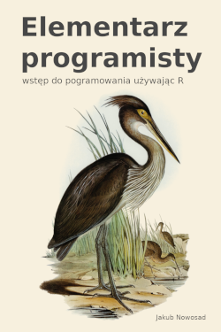

--- 
title: "Elementarz programisty"
subtitle: "Wstęp do programowania używając R"
author: "Jakub Nowosad"
# date: "2021-04-18"
description: "Wstęp do programowania używając R. Książka przeznaczona zarówno dla osób nowicjuszy programowania, jak też dla osób, które znają inne języki programowania, ale są zainteresowane poznaniem języka R."
site: bookdown::bookdown_site
output: bookdown::gitbook
documentclass: scrbook
classoption: "paper=6in:9in,pagesize=pdftex,headinclude=on,footinclude=on,10pt"
geometry: "top=1.6cm, bottom=2cm, left=2cm, right=2cm"
monofont: "Source Code Pro"
monofontoptions: "Scale=0.66"
bibliography: [references.bib, packages.bib]
biblio-style: apalike
link-citations: yes
github-repo: nowosad/elp
graphics: yes
links-as-notes: true
cover-image: "/cover/cover.png"
url: 'https\://nowosad.github.io/elp'
robots: "all,follow"
googlebot: "index,follow,snippet,archive"
---


# O książce {-}

<a href="http://nowosad.github.io/elp/"></a> 

**Elementarz programisty: Wstęp do programowania używając R** ma na celu wprowadzenie do podstaw działania w języku R. 
W pierwszej części, "Podstawy", opisuje ona w jaki sposób wykonywać proste operacje w R, czym są obiekty oraz jak tworzyć funkcje, które je przetwarzają.
Ta część zawiera także omówienie podstawowych narzędzi pozwalających na sterowanie przepływem informacji, takich jak wyrażenia warunkowe i pętle, metod działania na tekście, oraz sposobów wczytywania i zapisywania plików w różnych formatach.
Druga część, "Narzędzia", buduje na wiedzy zdobytej w części pierwszej i rozszerza ją.
Zawiera ona informacje na temat tworzenia funkcji przyjaznych użytkownikom oraz to w jaki sposób tworzyć odpowiednie komunikaty błędów, ostrzeżeń czy wiadomości.
W tej części następuje prezentacja metod analizy kodu, takich jak testy jednostkowe, benchmarking i profiling oraz sposobów rozwiązywania problemów z kodem używając technik debugowania.
Pokazanie są także możliwości łączenia R z innymi językami programowania C++ i Python.
Oprócz informacji ściśle powiązanych z R, **Elementarz programisty** ma także rozdział poświęcony systemom kontroli wersji - uniwersalnym narzędziom używanym przez programistów różnych języków.
Część "Narzędzia" kończy rozdział integrujący wiedzę z całej książki w postaci omówienia kolejnych kroków dotyczących tworzenia pakietów R.
**Elementarz programisty** zawiera też szereg praktycznych porad oraz wiele odnośników do dodatkowych materiałów, takich jak książki, blogi, kursy, czy strony internetowe.
Wszystkie rozdziały w tej książce dodatkowo zawierają zadania, które pozwalają na sprawdzenie i utrwalenie wiedzy.
Książka ta jest przeznaczona zarówno dla osób bez znajomości języków programowania, jak też dla osób, które znają inne języki programowania, ale są zainteresowane poznaniem języka R.
Uzyskana wiedza z tej książki daje podstawy do wykorzystywania R do różnorodnych celów, od analizy danych i opracowań statystycznych, poprzez tworzenie wykresów i wizualizacji, kończąc na aplikacjach specyficznych dla danej dziedziny.


Aktualna wersja książki znajduje się pod adresem https://nowosad.github.io/elp/. 
Jeżeli używasz tej książki, zacytuj ją jako:

- Nowosad, J., (2020). Elementarz programisty: wstęp do programowania używając R. Poznań: Space A. Online: https://nowosad.github.io/elp/. ISBN: 978-83-953296-1-9

Zachęcam również do zgłaszania wszelkich uwag, błędów, pomysłów oraz komentarzy na stronie https://github.com/nowosad/elp/issues.

<a rel="license" href="http://creativecommons.org/licenses/by-nc-nd/4.0/"></a><br />Ta książka jest dostępna na <a rel="license" href="http://creativecommons.org/licenses/by-nc-nd/4.0/">licencji Creative Commons Uznanie autorstwa - Użycie niekomercyjne - Bez utworów zależnych 4.0 Międzynarodowe</a>.

## Wymagania wstępne {-}

Do odtworzenia przykładów oraz do wykonania zadań zawartych w tej książce konieczne jest posiadanie aktualnej wersji **R**. 
Pod adresem https://cloud.r-project.org/ można znaleźć instrukcje instalacji R dla systemów Windows, Mac OS i Linux.

W niektórych rozdziałach użyte zostanie zintegrowane środowisko programistyczne **RStudio**.
Można je zainstalować korzystając ze strony https://www.rstudio.com/products/rstudio/download/#download.
<!-- https://rstudio-education.github.io/hopr/starting.html -->
<!--pakiety-->
<!-- dane -->

Aspekty dotyczące kontroli wersji zostaną omówione używając oprogramowania **Git**.
Zalecanym sposobem instalacji Git na Windows jest wersja ze strony https://gitforwindows.org/.
Instrukcja instalacji na system Mac OS znajduje się pod adresem https://happygitwithr.com/install-git.html#macos.
Wersję Linuxową można zainstalować używając poniższej linii kodu:

```
# Ubuntu
sudo apt install git
```

```
# Fedora
sudo dnf install git
```

## Styl książki {-}

W całej książce stosowana jest konwencja, w której `fun()` oznacza funkcje, `obi` oznacza nazwy obiektów, nazwy zmiennych oraz argumentów funkcji, a `sci/` oznacza ścieżki do plików.
Wszystkie pakiety użyte w tej książce oznaczane są pogrubioną czcionką - **pak**.

Tekst na szarym tle przedstawia blok kodu.
Może on zawierać komentarze (rozpoczynające się of znaku `#`), kod oraz wynik jego użycia (rozpoczynające się od znaków `#>`).


```r
# komentarz
kod
#> wynik użycia kodu
```

Dodatkowo, ikona kompasu przedstawia dodatkowe informacje, alternatywne sposoby użycia funkcji, czy też wskazówki.

\BeginKnitrBlock{rmdinfo}<div class="rmdinfo">Tutaj może znaleźć się dodatkowa informacja, alternatywny sposób użycia funkcji, czy też wskazówka.</div>\EndKnitrBlock{rmdinfo}

## Podziękowania {-}

Książka została stworzona w R [@R-base] z wykorzystaniem pakietów **bookdown** [@R-bookdown], **rmarkdown** [@R-rmarkdown], **knitr** [@R-knitr] oraz programu [Pandoc](http://pandoc.org/). 

Rysunek na okładce książki "Great-billed Heron (Ardea rectirostris)" został stworzony przez Elizabeth Gould do książki Birds of Australia Johna Goulda i został udostępniony na licencji <a href="https://creativecommons.org/publicdomain/zero/1.0/deed.en" title="CC0 1.0 Universal" target="_blank">CC0 1.0</a>.
<!-- https://ccsearch.creativecommons.org/photos/28692762-697a-42a8-964b-ee95843c5347 -->

Ikony użyte w tej książce zostały stworzone przez <a href="https://www.freepik.com/" title="Freepik">Freepik</a> z <a href="https://www.flaticon.com/" title="Flaticon">www.flaticon.com</a> na licencji <a href="http://creativecommons.org/licenses/by/3.0/" title="Creative Commons BY 3.0." target="_blank">CC 3.0 BY</a>.

<script>
  (function(i,s,o,g,r,a,m){i['GoogleAnalyticsObject']=r;i[r]=i[r]||function(){
  (i[r].q=i[r].q||[]).push(arguments)},i[r].l=1*new Date();a=s.createElement(o),
  m=s.getElementsByTagName(o)[0];a.async=1;a.src=g;m.parentNode.insertBefore(a,m)
  })(window,document,'script','https://www.google-analytics.com/analytics.js','ga');
  ga('create', 'UA-47892233-2', 'auto');
  ga('send', 'pageview');
</script>

